# Azure Cloud Monitoring Project  
**Azure Monitor | Log Analytics | Grafana | Alerting**

---

## Project Overview

This project demonstrates an **end-to-end cloud monitoring and alerting solution** using **Microsoft Azure native monitoring services integrated with Grafana**.

The implementation reflects **real-world Cloud Monitoring Engineer / SRE practices**, covering:
- Infrastructure monitoring
- Log analytics
- Visualization
- Alerting
- Incident simulation and notification

---

## Project Objectives

- Monitor Azure Virtual Machine performance metrics
- Centralize system logs using Log Analytics
- Visualize metrics and logs in Grafana
- Detect warnings and errors using log queries
- Trigger automated alerts based on log conditions
- Send real-time email notifications
- Simulate real production incidents

---

## Architecture Overview

### Monitoring Flow

1. Linux VM generates system metrics and logs  
2. Azure Monitor collects platform metrics  
3. Azure Monitor Agent (AMA) forwards logs  
4. Log Analytics Workspace stores and indexes logs  
5. Grafana queries Azure Monitor and Log Analytics  
6. Log-based alerts detect issues  
7. Action Groups send email notifications  

### Architecture Diagram

---

## 🛠️ Technologies Used

- Microsoft Azure  
- Azure Virtual Machine (Linux)  
- Azure Monitor  
- Log Analytics Workspace  
- Azure Monitor Agent (AMA)  
- Grafana (Local installation)  
- Azure AD App Registration (Service Principal)  
- Azure Alerts & Action Groups  
- Kusto Query Language (KQL)  

---

# Project Implementation – Azure Cloud Monitoring & Alerting

## Step 1: Resource Group Setup

A dedicated **Resource Group** was created to logically group all monitoring-related resources such as the VM, Log Analytics Workspace, alerts, and action groups.

**Why this step matters**
- Provides logical isolation
- Simplifies access control and cleanup
- Follows enterprise Azure best practices

Screenshot:  
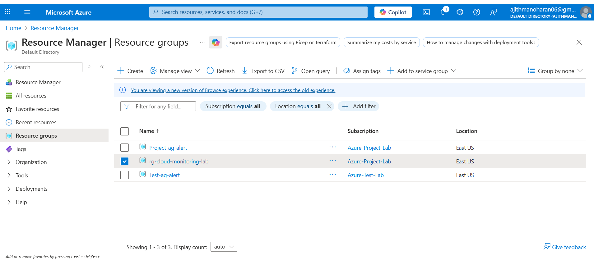

---

## Step 2: Linux Virtual Machine Deployment & Nginx installation 

A **Linux Virtual Machine** was deployed and to simulate a real workload that generates metrics and logs, Nginx is installed. 

**Why this step matters**
- Most enterprise workloads still run on VMs
- Monitoring engineers must understand VM-level observability
- Provides real telemetry for testing alerts

Screenshot:  
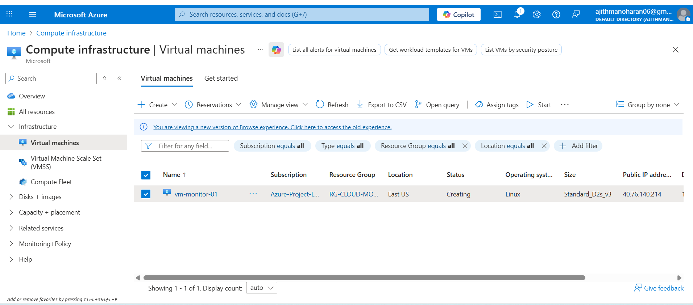

---

## Step 3: Log Analytics Workspace Creation

A **Log Analytics Workspace** was created to act as the centralized log storage and analytics engine.

**Why this step matters**
- Central location for querying logs
- Required for Azure Monitor, VM Insights, and log-based alerts
- Acts like Elasticsearch in ELK-based systems

Screenshot:  
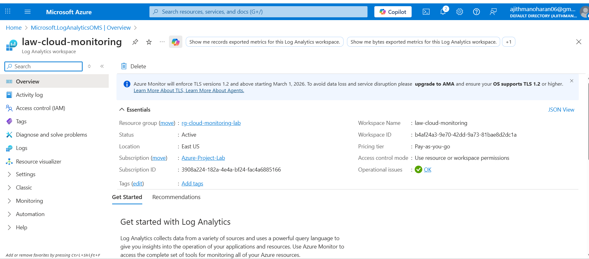

---

## Step 4: Azure Monitor Agent (AMA) Installation

The **Azure Monitor Agent (AMA)** was enabled on the VM to collect:
- Performance metrics
- Syslog events

**Why this step matters**
- AMA is the modern replacement for legacy agents
- Required for VM Insights and Data Collection Rules
- Ensures secure, scalable telemetry collection

Screenshot:  
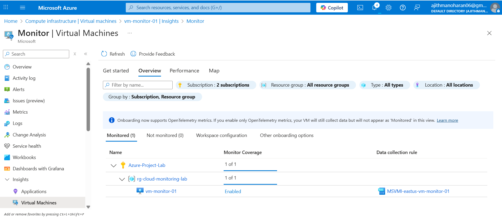

---

## Step 5: Data Collection Rule (DCR) Configuration

A **Data Collection Rule (DCR)** was created to define:
- What data should be collected (Syslog, performance counters)
- Where the data should be sent (Log Analytics Workspace)

**Why this step matters**
- Fine-grained control over telemetry
- Prevents unnecessary data ingestion
- Reduces cost and noise

Screenshot:  
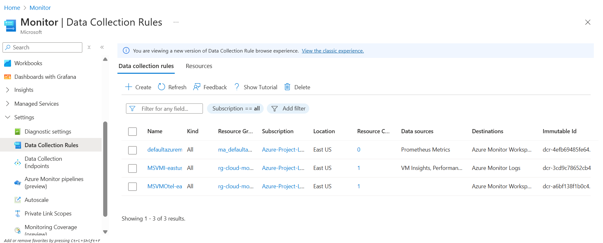

---

## Step 6: Azure AD App Registration for Grafana

An **Azure AD App Registration (Service Principal)** was created to allow Grafana secure, read-only access to Azure Monitor data.

**Why this step matters**
- Enables secure service-to-service authentication
- Avoids using personal credentials
- Follows least-privilege access principles

Screenshot:  

---

## Step 7 : Ingestion of Real Errors & Filtering Logs by Severity 
- To simulate real production incidents, logs were manually injected into the VM
- To simulate real production incidents, logs were manually injected into the VM:

**Why this step matters**
- To experience the real workload
- Sorting the incidents based on the severity using KQL Query

Screenshot:  
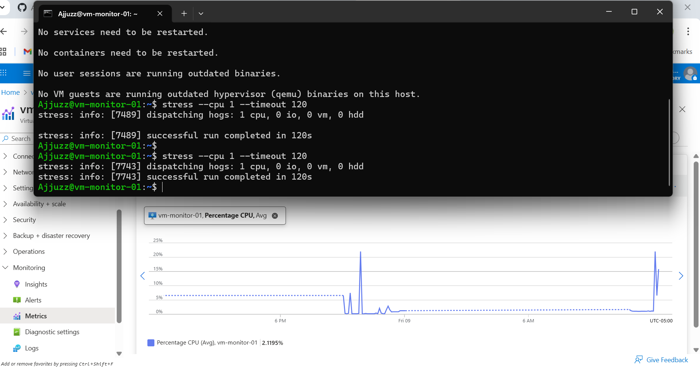
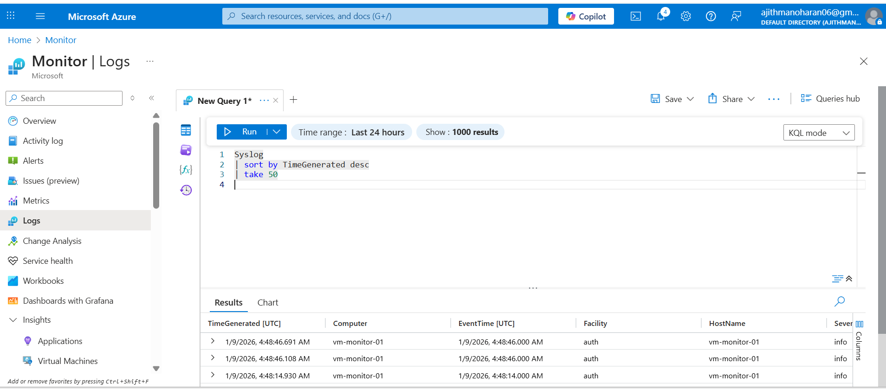

---

## Step 8: Grafana Integration with Azure Monitor

Grafana was configured using:
- Tenant ID
- Client ID
- Client Secret
- Subscription ID

Azure Monitor was added as a **Grafana data source**.

**Why this step matters**
- Grafana provides a single-pane-of-glass view
- Commonly used in real monitoring teams
- Complements Azure-native dashboards

Screenshot:  
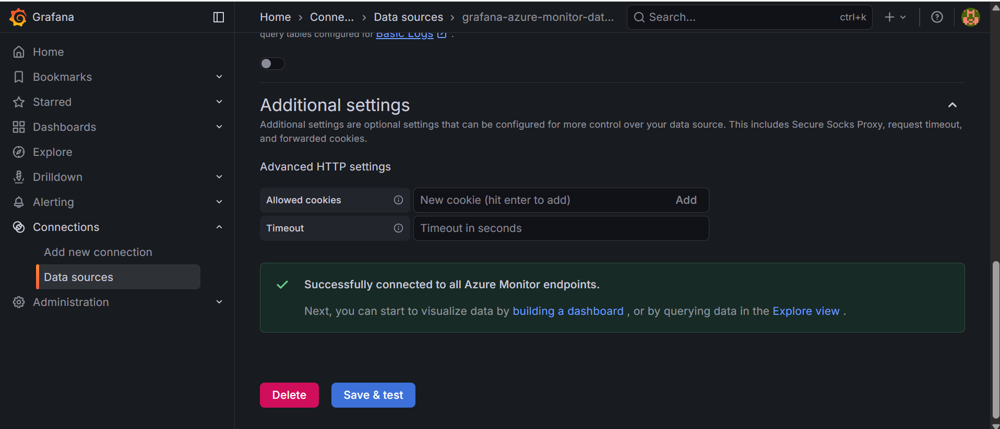

---

## Step 9: Metrics Visualization in Grafana

Custom dashboards were created to visualize:
- CPU utilization
- Memory usage
- Disk I/O
- Network traffic

**Why this step matters**
- Enables real-time infrastructure visibility
- Helps correlate metrics with incidents
- Improves operational awareness

Screenshot:  
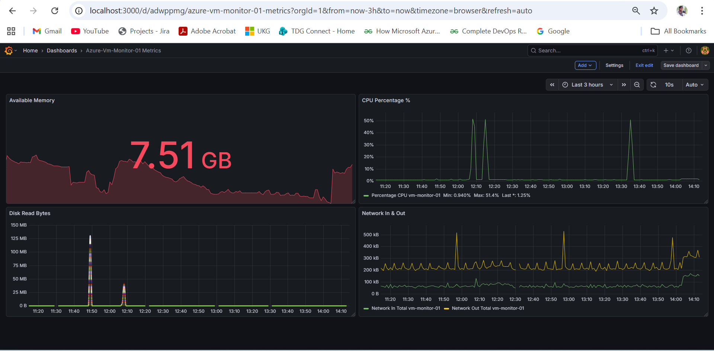
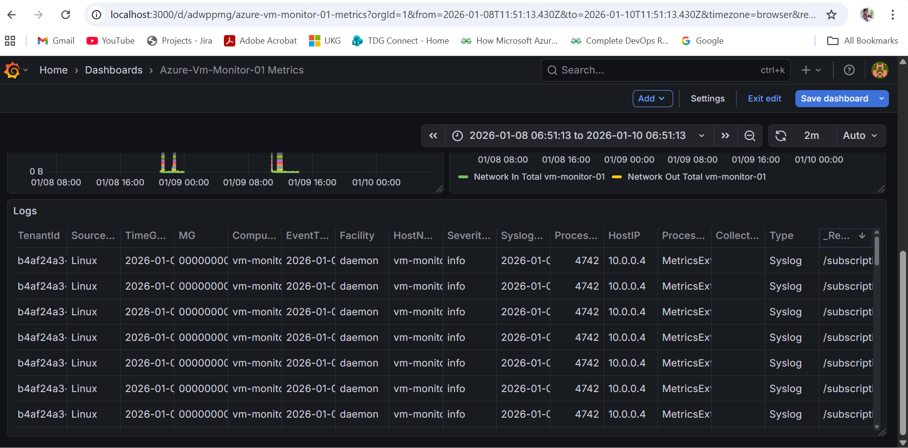

---

## Step 10: Log Generation and Analysis Using Azure Monitor Logs

To validate end-to-end log monitoring and troubleshooting, system logs were manually generated on the Azure Virtual Machine and analyzed using Azure Monitor Logs (Log Analytics).

**Why this step matters**
- Demonstrates real production-style log generation and ingestion
- Enables deep log analysis similar to Logz.io or Elastic Cloud
- Builds core skills required for Cloud Monitoring and SRE roles

Screenshots:  
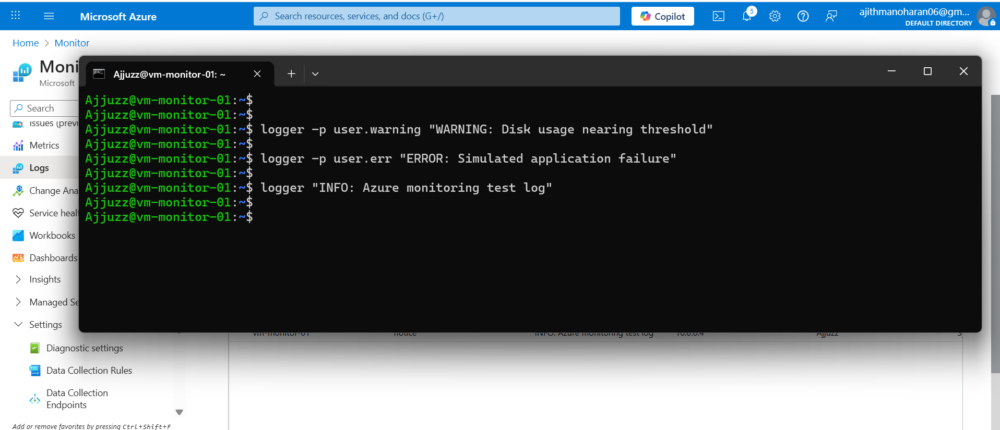  
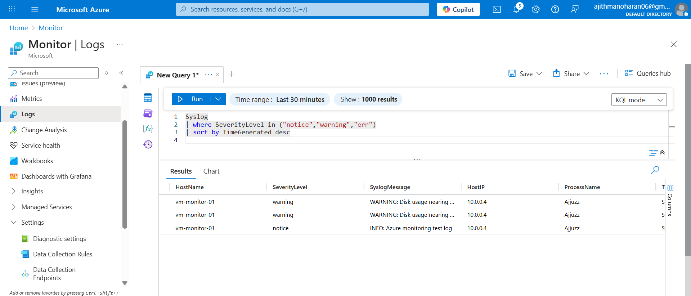

---

## Step 11: Log-Based Alert Rule Creation (Azure Monitor)

A custom **Log Search Alert Rule** was created using Azure Monitor to automatically detect critical log patterns and notify stakeholders via email when issues occur.

**Why this step matters**
- Enables **proactive incident detection** based on real application and system logs.
- Reduces **Mean Time to Detect (MTTD)** by automatically flagging issues.
- Demonstrates real-world **log-based monitoring and alerting** using Azure-native services.
- The alert triggers when matching log entries are found and executes an **Action Group** to send email notifications.

Screenshots:  
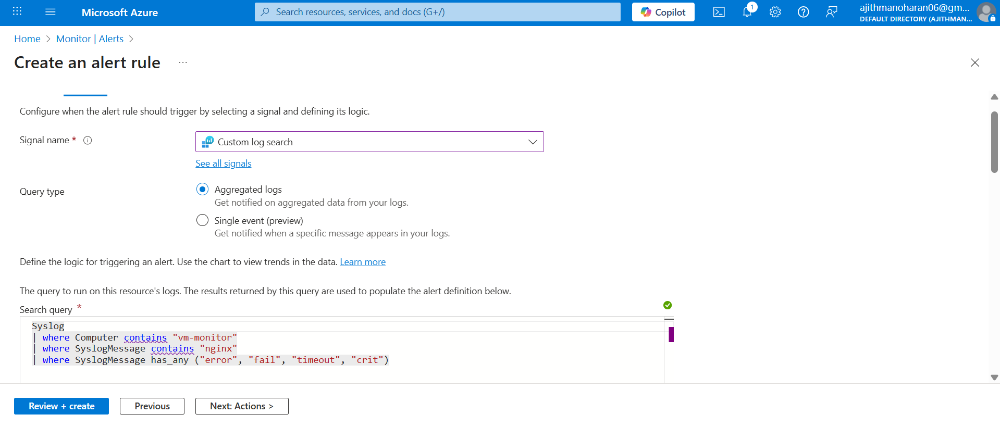  

---

## Step 12: Alert Notification Validation (Email Delivery)

To complete the monitoring workflow, the configured log-based alert was validated by confirming successful email notification delivery when the alert condition was met.

**Why this step matters**
- Confirms end-to-end monitoring from **log generation → alert detection → notification delivery**.
- Ensures alerting mechanisms work reliably in real incident scenarios.
- Demonstrates production-ready **incident response and alert validation** skills.

Screenshot:  
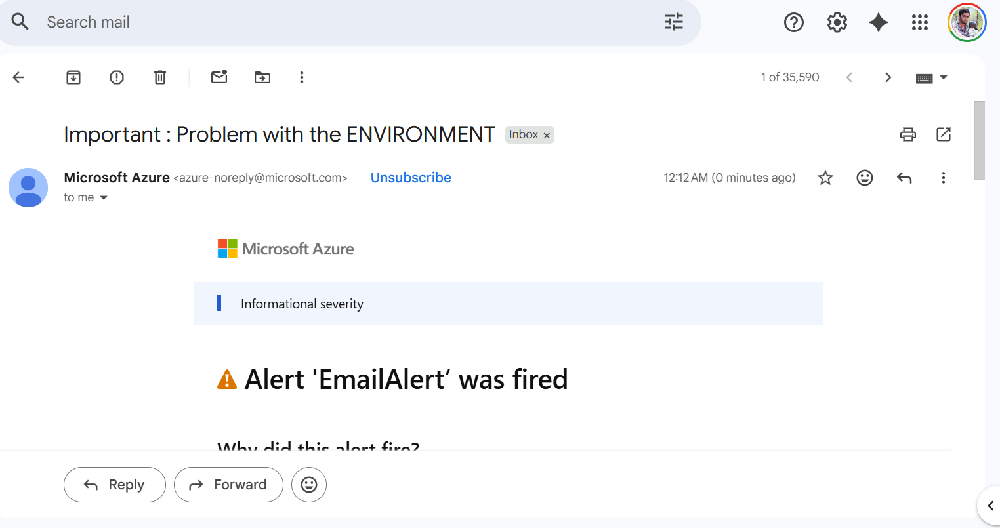

---

## Conclusion

This project demonstrates a complete, end-to-end cloud monitoring and alerting solution built using native Microsoft Azure services and Grafana. Starting from infrastructure setup, the solution captures system metrics and logs, analyzes them using KQL, visualizes performance trends in Grafana, and triggers automated alerts with real-time email notifications.

Through this implementation, I gained hands-on experience with Azure Monitor, Log Analytics, Syslog ingestion, custom KQL queries, log-based alert rules, action groups, and alert validation workflows. I also simulated real-world incidents such as CPU stress and application log errors to validate monitoring accuracy and alert reliability.

